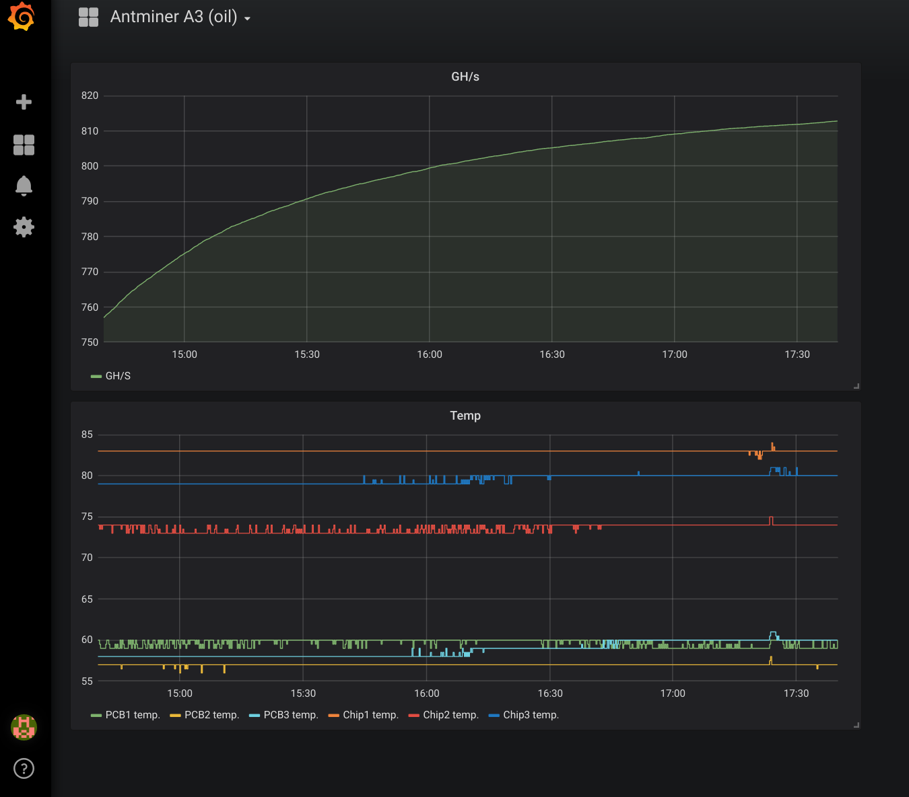

# Get stats from Antminer (cgminer) and display graphs in grafana. Everything inside docker using docker-compose.

## Starting

 * Change `- MINER_HOST=192.168.1.99` to your Antiminer IP-address in `docker-compose.yaml`
 * Run command: `docker-compose up`
 * Open `http://127.0.0.1:3000` in your web-browser
 * Done

You should see `grafana` login page. User: `admin` password: `admin`. Choose dashboard on top menu and you will see graphs with GH/sec and temperature of the Antminer PCB and chips:

